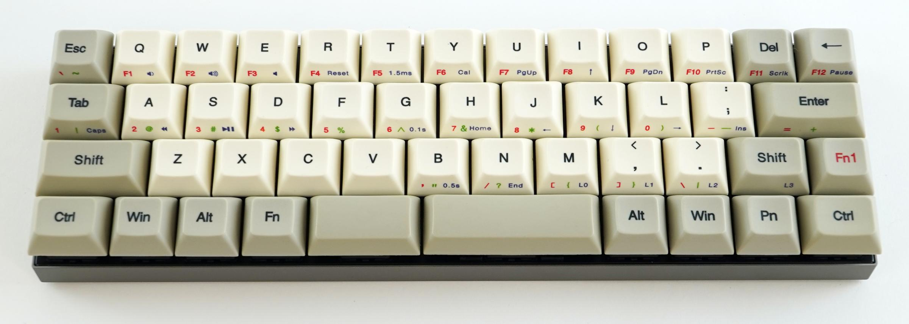
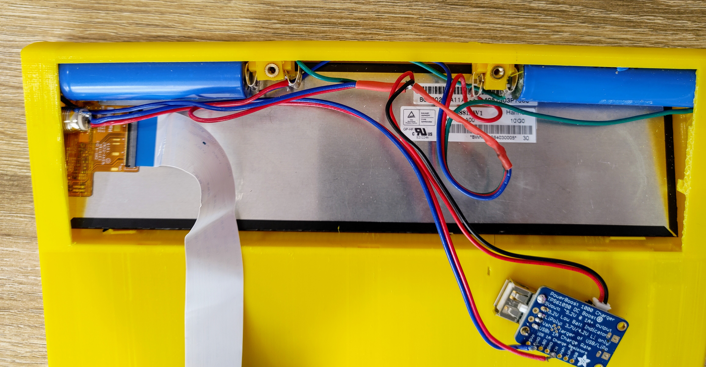
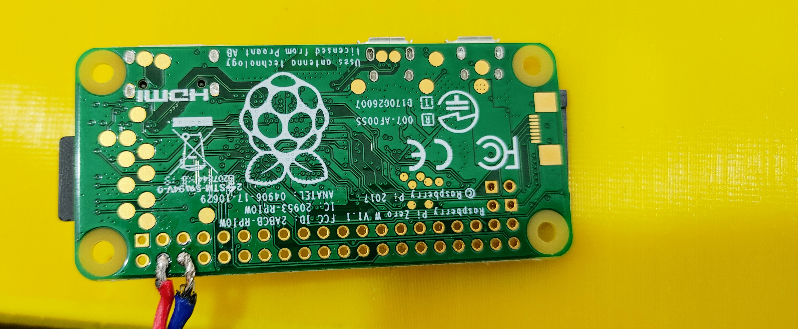
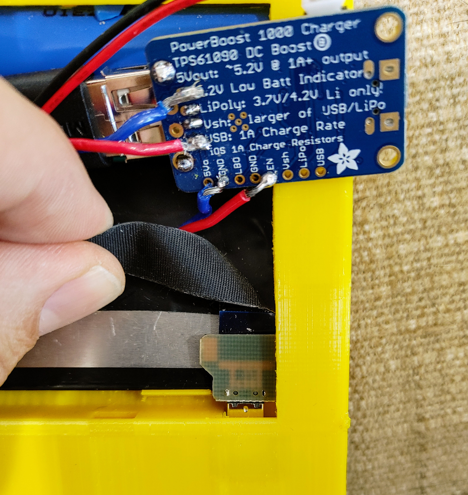
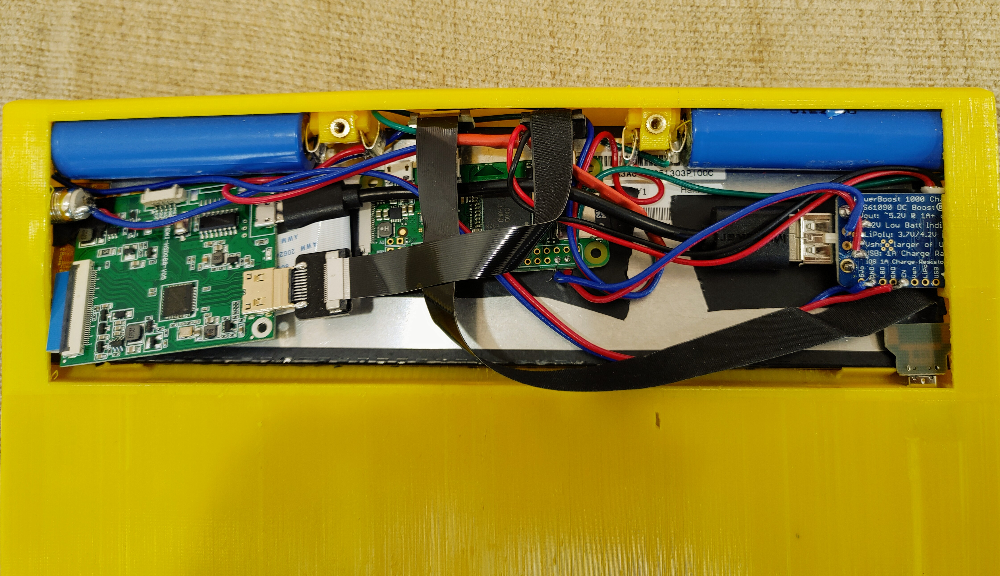

# Lisperati 1000 DIY Build Instructions
_Author: Conrad Barski, CEO of Lisperati Inc._

In this _How To_ we're going to build a fully-working Lisperati1000 computer using 3D printed parts and off-the-shelf components. If you would, instead, like to purchase a fully-assembled Lisperati1000 with a milled aluminum chassis, please join the mailing list at [on home page](lisperaticomputers.com) to be notified when they become available for purchase.

_Note: These DIY instructions are provided free of charge, and we do accept any liability for errors in the instructions. They are provided without support._

## Printing the Chassis

It is best to print the chassis using a higher-temperature plastic, such as PETG or ABS. This is because PLA plastic (the most popular plastic for 3D printing) tends to deform in a year or two, if placed under stress. Also, if you ever leave your computer in a hot car, the PLA version can actually begin to melt under those conditions.

![lisperati_chassis.png]lisperati_chassis.png

![case_cover.png]case_cover.png

The chassis consists of two parts, the main body and the compartment cover. Here are the STL files:

- [lisperati_chassis.stl](lisperati_chassis.stl)
- [case_cover.stl](case_cover.stl)

The largest dimension of the main body is 247mm, which is beyond the print dimensions of many 3d printers. However, you will probably be able to print it diagonally. On the Creality Ender V2 (a popular 3D printer) there are 250mm of clearance in the Z dimension, so you should be able to print the model in a vertical orientation.

These STL files are not free standing models, so to print these parts you will definitely need to add supports, using your favorite 3D slicer software.

## The Keyboard

The Lisperati1000 uses the keycaps, switches, and PCB of a standard Vortex Core keyboard, which you can purchase here: https://mechanicalkeyboards.com/shop/index.php?l=product_list&c=375

To install the keyboard into the Lisperati1000 chassis, simply remove the keycaps from the Vortex Core, which will reveal multiple screws which attach the PCB to the case. After those screws are removed, place it into the chassis, then use ####### screws to attach. Note that due to resolution limitations, the chassis does not have screw threads, but the screws will still fit snuggly into the screw holes and will keep the keyboard in place securely.

## The Battery

Disclaimer: We make no guarantees as to the safety of the battery design in these DIY instructions. Please make sure you have electrical engineering experience, or consult with an electrical engineer, before implementing the battery circuits as described below. If you experience injury or cause a fire using these freely-provided DIY instrunctions, it is your own fault.

The Lisperati1000 uses two 18650 battery cells, placed in parallel. It is very improtant that the two cells are perfectly balanced. If they are not balanced, it can pose a fire hazard. Theoretically, you can obtain balanced cells by purchasing a 2-cell battery pack, such as this one and disassembling it (https://www.adafruit.com/product/354) but we make no guarantees this will work. Do this at your own risk. Such a battery pack also has a circuit inside to protect against overcharging, which you would also want to wire into the Lisperati1000 circuit.

The 3D printed chassis has groves for inserting the tabs from battery holders that can be obtained by dissassembling the [holders shown here](https://www.amazon.com/gp/product/B07CWKGZXW). Next, solder some wires to the holders to complete a parallel battery circuit (the same circuit configuration as found in the battery pack). You will want to use heat shrink tubing and electrical tape to fully insulate the holders.

## The Screen

The Lisperati1000 uses an ultrawide LCD screen, available [here](https://www.amazon.com/gp/product/B086HK9FKQ). You will need the included controller board, as well. Simply wedge the display into the chassis.

## The remaining components

After the screen has been inserted, insert the batter cells and the follwing additional components, to complete the working computer:

- [Adafruit Powerboost 1000 Charger](https://www.adafruit.com/product/2465)
- [Raspberry Pi Zero W](https://www.raspberrypi.org/products/raspberry-pi-zero-w/) You will also need a micro SD card with an OS along with the Raspberry Pi. For this device, we recommend the Raspbian Lite OS, since the Lisperati1000 is optimized for a terminal Linux interface, not a GUI interface.
- [Locking Power Switch](https://www.amazon.com/gp/product/B07MQ86LYD)
- A short micro usb to usb cable (to connect the video controller board to the PowerBoost)

Due to the tight space constraints, you will need to construct 2 custom cables using [Adafruit's DIY cable portal](https://www.adafruit.com/category/997):

- A 10cm ribbon HDMI mini to Right bend HDMI mini (to connect RasPi with video controller board) 
- A 10cm ribbon micro USB to Right bend micro USB (to connect RasPi with keyboard controller)

## Soldering Components to the PowerBoost

Two components need to be soldered directly to the PowerBoost board:

- The power switch
- The Raspberry Pi (in order to reduce cable clearance)

Here you can see the bottom of the PowerBoost, before the addition of protective heatshrink on the wiring:

![boost.jpg]

The two wires on the left, soldered to the top and bottom USB pins, power the pi zero. The two wires on the bottom, to the GND and EN pin, connect to the power switch.

The reason we solder the power for the Raspberry Pi directly to the PowerBoost, as opposed to using a usb cable, is because (1) it frees up the PowerBoost USB for the display controller and (2) because using the micro USB connector on the Raspberry Pi adds too much bulk, making it otherwise impossible to fit the Raspberry Pi in the Lisperati1000 chassis.

The wires on the pi zero are attached as follows, again before the addition of heatchshrink:

## Putting The Hardware Together

The components are wired together as shown in the following diagram:

To connect the keyboard to the pi zero, we use the compact USB cable and thread it through the hole to the keyboard connector, as shown here:

Here is what everything looks like once everything has been put together. You can now see how the angled HDMI and USB connectors on the pi zero are necessary to make everything fit in the compartment:

You will want to add heatshrink and fishtape to prevent electrical shorts: Note that the back of the LCD is electrically conductive and therefore cannot be touched by any of the circuit boards for proper functioning.

## Software Configuration

This computer is definitely optimized for text entry, not a UI interface. Hence, I recommend installing a console-only version of linux. A Raspbery Pi Zero kit will usually come with an SD cards containing the NOOBS installer, which will allow you to install a console version of the Raspbian OS. If you are not presented with a Console-only option, simply install Raspbian with a UI and run `sudo raspi-config` to enable a boot directly into a console.

Begin the installation by connecting the Pi Zero to a traditional HDMI monitor. Once the OS is ready, you can configure it to run properly on the ultrawide LCD. In order to drive this LCD, you will need to add the following to the bottom of `/boot/config.txt`:

``
hdmi_group=2
hdmi_mode=87
hdmi_drive=2
hdmi_force_mode=1
hdmi_timings=480 0 30 30 30 1920 0 6 6 6 0 0 0 60 0 66000000 7
max_framebuffer_width=1920
max_framebuffer_height=1920
framebuffer_width=1920
framebuffer_height=480
display_rotate=1
``

After those changes and a reboot, Raspbian should correctly display on the ultrawide LCD.

Another change you will want to make is to increase the console font size. Do this by editing `/etc/default/console-setup` to include the following:

``
FONTFACE="TerminusBold"
FONTSIZE="16x32"
``

After that change and a reboot, the console should be using a comfortably-large font.

_(Note: The Raspbian console uses color variation to indicate font boldness, causing the default console font to use a grey color by default... not pure white. Most console-based editors/etc will adjust for this, defaulting to brighter, pure white text.)_
